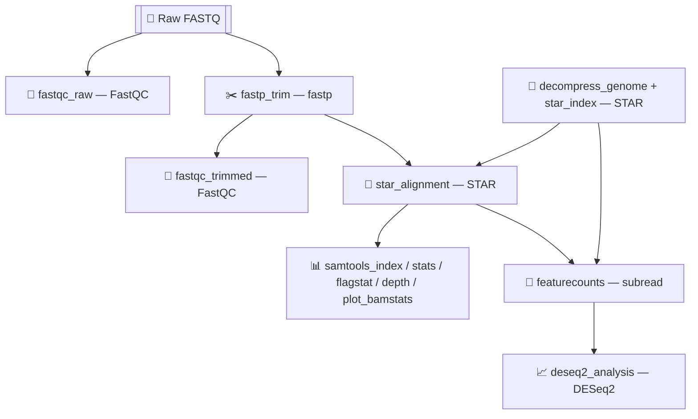
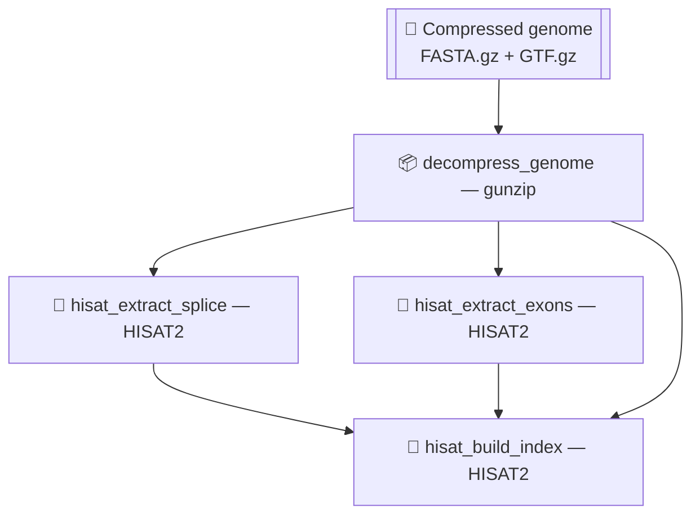

# ngs-repository-project

NGS analysis pipeline: QC, trimming, alignment, and downstream analysis.

# NGS RNA-seq Pipeline — Project Overview

> Personal project to learn RNA-seq data analysis: from raw read quality control to gene expression quantification and differential expression analysis.

## Goal

Build reproducible NGS analysis pipelines with **Snakemake**, using standard bioinformatics tools, as a hands-on exercise to develop sequencing data analysis skills.

## Snakemake aim & Docker aim

Reproducibility is a core design goal of this project, not an afterthought — every tool and dependency is pinned so that the same analysis can be re-run later, or on another machine, with identical results.

- **Snakemake aim:** define the pipeline as an explicit dependency graph (rules, inputs, outputs), keeping each step's provenance traceable, avoiding stale or partial re-runs (only outdated outputs are rebuilt), and pinning tool versions per rule via its own conda environment (`conda:` directive) rather than relying on a single global environment.
- **Docker aim:** freeze the OS-level environment (Linux + conda/mamba) that bioconda tools require, since most bioinformatics packages (samtools, STAR, HISAT2, ...) are only distributed for Linux. This removes "works on my machine" issues when running on Windows or on a different host, and makes the pipeline easy to launch and transfer to any machine with Docker installed.

Together, Snakemake (workflow/tool-version consistency) and Docker (OS/environment consistency) are what make a pipeline run today reproducible months later or on a different machine.

## Project status

| Pipeline | Aligner | Status |
|---|---|---|
| `pipelines/rna-seq` | STAR | ✅ Complete: QC → trimming → alignment → gene counting → DESeq2 |
| `pipelines/rna-seq/hisat_pipeline` | HISAT2 | 🚧 In development: currently only builds the genome index |

## Repository structure

```
ngs-repository-project/
├── Dockerfile                    # Linux environment with conda/mamba (bioconda tools only run on Linux)
├── data/
│   ├── raw/rna-seq/               # raw FASTQ files
│   └── reference/                 # genome and annotation (FASTA + GTF)
├── shared/
│   ├── envs/                      # shared conda environments (base.yml, base_hisat2.yml, ...)
│   └── lib/                       # code reused (python, R, shell) across pipelines
├── pipelines/
│   └── rna-seq/
│       ├── Snakefile              # main pipeline, based on STAR
│       ├── PIPELINE.md            # detailed diagram of the STAR workflow
│       ├── envs/                  # pipeline-specific conda environments (rna-seq.yml, deseq2.yml)
│       ├── scripts/r/             # DESeq2 scripts
│       └── hisat_pipeline/        # new alternative pipeline based on HISAT2
│           ├── Snakefile
│           └── config.yml
└── results/rna-seq/<run_id>/      # output of each run, organized by stage
```

## Pipeline 1 — `rna-seq` (STAR), complete

Nine steps, from raw FASTQ to per-gene count table and differential expression analysis:



Full step-by-step diagram, with all intermediate files: [`pipelines/rna-seq/PIPELINE.md`](pipelines/rna-seq/PIPELINE.md).

**Current final target** (`rule all`): `results/rna-seq/<run>/deseq2/volcano_plot.png`.

**Environments used:** `envs/rna-seq.yml` (FastQC, fastp, STAR, samtools, subread) and `envs/deseq2.yml` (R, DESeq2, ggplot2), kept separate so the main environment isn't bloated with R.

## Pipeline 2 — `hisat_pipeline` (HISAT2), in development

Same logic as the STAR pipeline, but with HISAT2 as the aligner (lighter weight, well suited to genomes with many isoforms thanks to native splice-site support). For now it only covers genome preparation:



**Current final target** (`rule all`): `results/rna-seq/<run>/genome/genome_index_prefix` (the HISAT2 genome index).

**Next steps to implement:** alignment with `hisat2`, counting with `featureCounts`, BAM QC and differential expression analysis — reusing, where possible, the scripts already written for the STAR pipeline (`shared/lib`, `scripts/r/`).

## Environments and execution

- Bioconda tools (samtools, hisat2, fastp, ...) only run on Linux → the environment is built inside a Docker container ([`Dockerfile`](Dockerfile)), not natively on Windows.
- Conda environments are split by purpose:
  - `shared/envs/base.yml` — full environment used by the Dockerfile.
  - `shared/envs/base_hisat2.yml` — minimal environment for the HISAT2 pipeline only (FastQC, fastp, HISAT2, samtools, subread, MultiQC, Snakemake).
  - `pipelines/rna-seq/envs/rna-seq.yml` and `.../deseq2.yml` — per-rule environments invoked by Snakemake via `conda:`.

**Typical execution** (from inside the Docker container, from the repo root):

```bash
snakemake -s pipelines/rna-seq/Snakefile --cores 4                       # STAR pipeline
snakemake -s pipelines/rna-seq/hisat_pipeline/Snakefile --cores 4        # HISAT2 pipeline
```

## Tools used

FastQC · fastp · STAR · HISAT2 · samtools · subread (featureCounts) · DESeq2 · Snakemake · Docker/conda (mamba)

## Contributors

- [Stefano Bianchi](https://github.com/stefanobianchi1999-droid)
- [flyDaniel](https://github.com/flyDaniel)

## License

This project is licensed under [CC BY-NC 4.0](LICENSE) — free to use, share and adapt for non-commercial purposes, with attribution.
