# RNA-seq Pipeline — Flow

Diagram of the Snakemake workflow defined in [Snakefile](Snakefile). Each box shows: **rule name**, **what it does** and **tool used**, from the raw files down to the final gene count table.

```mermaid
flowchart TD
    raw[["📂 INPUT\ndata/raw/rna-seq/&#123;sample&#125;_1/2.fastq.gz\n(raw reads, not yet cleaned)"]]

    subgraph QC1["STAGE 1 — Quality check on raw reads"]
        fastqc_raw["🔎 rule: fastqc_raw\nChecks read quality BEFORE cleaning\nTool: FastQC"]
        qc_before[["📄 HTML report\nbefore/fastqc/*.html"]]
        fastqc_raw --> qc_before
    end

    subgraph TRIM["STAGE 2 — Read cleaning"]
        fastp["✂️ rule: fastp_trim\nTrims adapters and low-quality bases\nTool: fastp"]
        trimmed[["📂 Cleaned reads\ntrimmed/&#123;sample&#125;_1/2.fastq.gz"]]
        fastp_report[["📄 Cleaning report\ntrimmed/*_fastp.html/json"]]
        fastp --> trimmed
        fastp --> fastp_report
    end

    subgraph QC2["STAGE 3 — Quality check after cleaning"]
        fastqc_trimmed["🔎 rule: fastqc_trimmed\nRe-checks quality AFTER cleaning\n(verifies the trimming worked)\nTool: FastQC"]
        qc_after[["📄 HTML report\nafter/fastqc/*.html"]]
        fastqc_trimmed --> qc_after
    end

    subgraph GENOME["STAGE 4 — Reference genome preparation"]
        genome_gz[["📂 Compressed genome\nfasta.gz + gtf.gz"]]
        decompress["📦 rule: decompress_genome\nUnpacks the genome files\nTool: gunzip"]
        genome[["📂 Genome ready\nfasta + gtf"]]
        star_index["🧬 rule: star_index\nBuilds the genome index\n(needed before the reads can be aligned)\nTool: STAR"]
        index[["📂 STAR index ready\nGENOME_DIR"]]
        genome_gz --> decompress --> genome --> star_index --> index
    end

    subgraph ALIGN["STAGE 5 — Aligning reads to the genome"]
        star_align["🎯 rule: star_alignment\nAligns the cleaned reads against the genome\nand produces a sorted BAM file\nTool: STAR"]
        bam[["📂 Aligned file\naligned/&#123;sample&#125;_Aligned.sortedByCoord.out.bam"]]
        star_align --> bam
    end

    subgraph BAMQC["STAGE 6 — Alignment quality checks (BAM)"]
        samtools_index["📇 rule: samtools_index\nCreates the BAM index\n(needed for fast region access, e.g. IGV)\nTool: samtools index"]
        bai[["📄 *.bam.bai"]]

        samtools_stats["📊 rule: samtools_stats\nComputes detailed alignment statistics\nTool: samtools stats"]
        stats[["📄 *_samtools_stats.txt"]]

        flagstat["📋 rule: samtools_flagstat\nQuick summary: how many reads aligned,\nhow many were discarded, etc.\nTool: samtools flagstat"]
        flagstat_out[["📄 *_flagstat.txt"]]

        depth["📈 rule: samtools_depth\nComputes per-base coverage depth\nTool: samtools depth"]
        depth_out[["📄 *_depth.txt"]]

        plot["📉 rule: plot_bamstats\nTurns the statistics into\neasy-to-read plots\nTool: plot-bamstats"]
        plots[["🖼️ *_bamstats_plots/index.html"]]

        samtools_index --> bai
        samtools_stats --> stats
        flagstat --> flagstat_out
        depth --> depth_out
        stats --> plot --> plots
    end

    subgraph COUNT["STAGE 7 — Counting reads per gene"]
        featurecounts["🧮 rule: featurecounts\nCounts how many reads fall on each gene,\nusing ALL samples together\nTool: featureCounts"]
        counts[["📄 FINAL OUTPUT\ncounts/gene_counts.txt\n(table: gene x sample)"]]
        featurecounts --> counts
    end

    raw --> fastqc_raw
    raw --> fastp
    trimmed --> fastqc_trimmed
    trimmed --> star_align
    index --> star_align
    bam --> samtools_index
    bam --> samtools_stats
    bam --> flagstat
    bam --> depth
    bai --> depth
    bam --> featurecounts
    genome --> featurecounts

    counts --> all(["🏁 rule: all\nFinal target requested\nby Snakemake"])
```

## How to read the diagram

- **📂 / 📄 / 🖼️** = a file (input or output).
- **Colored boxes with an action emoji** (🔎✂️🧬🎯📇📊📋📈📉🧮) = a **rule** in the Snakefile, i.e. a pipeline step that runs a command.
- **Arrows** mean "this file is needed for this step" or "this step produces this file".
- The grouped boxes ("STAGES") represent a logical moment in the pipeline, not a specific rule.

## Practical notes

- **What actually gets produced today**: in the `Snakefile`, `rule all` only requests `results/rna-seq/{run}/counts/gene_counts.txt` (STAGE 7). The other stages (FastQC, samtools stats, plots) are written and working, but **disabled as a final target** (commented-out lines in `rule all`) — they only run if triggered manually, e.g. `snakemake results/rna-seq/{run}/before/fastqc/...`.
- **`{run}`** = run identifier (`config["run_id"]`), e.g. a date or experiment name.
- **`{sample}`** = sample name, taken from the `config["samples"]` list.
- **Environment**: almost every step runs inside the `envs/rna-seq.yml` conda environment, which contains FastQC, fastp, STAR, samtools, and subread (featureCounts).
